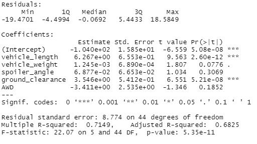

# MechaCar Statistical Analysis

## Linear Regression to Predict MPG
Here is the summary of our Linear Regression:

* Which variables/coefficients provided a non-random amount of variance to the mpg values in the dataset?
  * The two variables excluding the intercept that are statistically significant are vehicle_length and ground_clearance.
* Is the slope of the linear model considered to be zero? Why or why not?
  * Based on our p-value, we know that the linear model should not be considered 0. 
* Does this linear model predict mpg of MechaCar prototypes effectively? Why or why not?
  * Although this linear model is statistically significant, having 2/5 variables outside of the intercept being significant doesn't indicate an effective model. We should look to see if we can find any other significant variables, such as engine cylinders.

## Summary Statistics on Suspension Coil
Total Summary

Lot Summary

The design specifications for the MechaCar suspension coils dictate that the variance of the suspension coils must not exceed 100 pounds per square inch. Does the current manufacturing data meet this design specification for all manufacturing lots in total and each lot individually? Why or why not?

Looking at our tables we can see that overall, the variance is 62.29 which is under our 100 pounds per square inch requirement. But, looking further into our Lot summary shows that Lot 3 is actually well over the limit at 170 variance whereas it's counterparts Lot 1 and 2 are close to excellency. 

## T-Tests on Suspension Coils
**All Lots**

Based on the above information we can see the test barely passes with a score -1.8931 which is under our 1.975 requirement. Which means that it is possible that the true mean is 1500

**Lot 1** 

Based on the above information we can see the test clearly passes with a score of 0. Which means that it is possible that the true mean is 1500.

**Lot 2** 

Based on the above information we can see the test clearly passes with a score of .51. Which means that it is possible that the true mean is 1500.

**Lot 3** 

Based on the above information we can see the test fails with a score of -2.0918 which us over the 1.975 limit. Which means that it is not possible that the true mean is 1500.

## Study Design: MechaCar vs Competition
One metric I would be interested in testing is the connection between vehicle weight and engine cylinders against mpg. The null hypothesis for this study would be that weight and engine cylinders have no effect on mpg. The alternative hypothesis is that weight and engine cylinders does have an effect on mpg. I would recommend using a 2 sample t test, using the two most common engine cylinder counts of 4 and 6. To perform this we need data on vehicle engine cylinders and the vehicle weight which we already have.  
